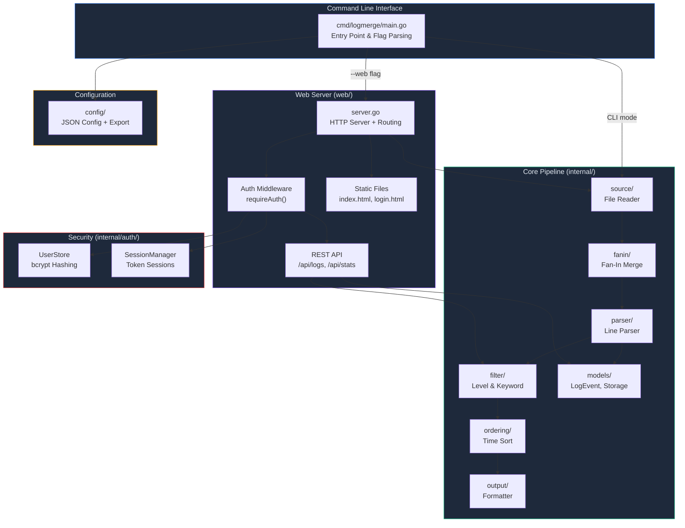
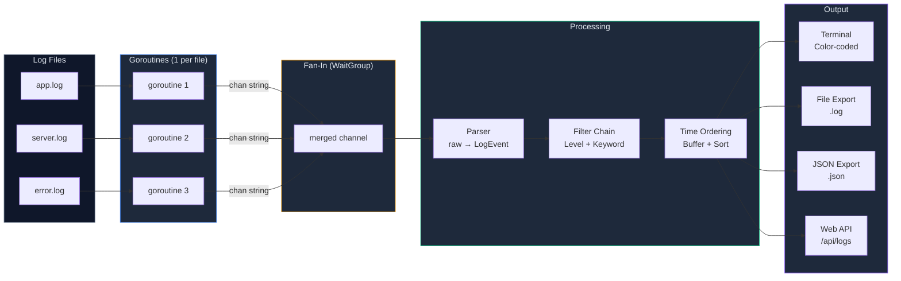
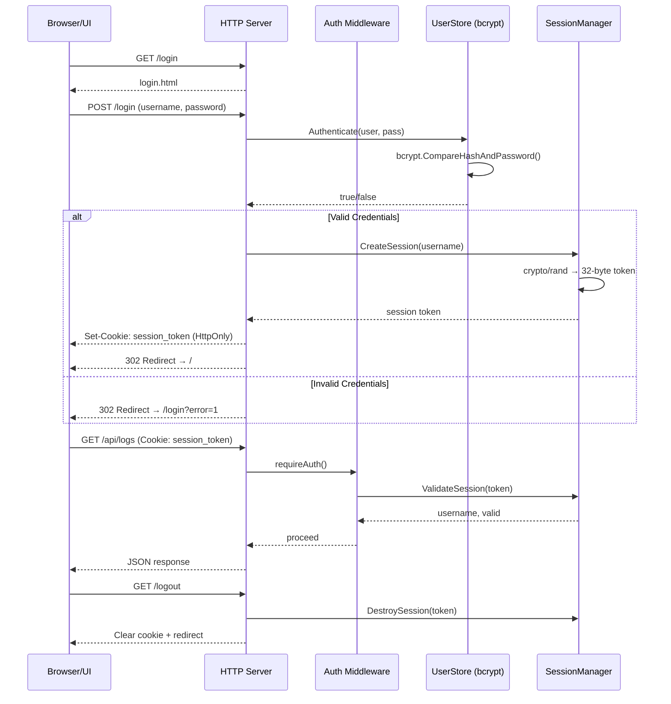

# LogAggregator — Architecture & Design

## System Overview



---

## Concurrent Data Flow Pipeline



---

## Web Authentication Flow



---

## Project Directory Structure

```
LogAggregator/
├── cmd/logmerge/
│   └── main.go              ← Entry point, CLI flags, pipeline orchestration
├── internal/
│   ├── auth/                ← 🔐 bcrypt hashing + session management
│   │   ├── auth.go
│   │   └── auth_test.go
│   ├── config/              ← JSON config loading + export
│   ├── fanin/               ← Fan-in channel merge pattern
│   ├── filter/              ← Interface-based filter chain (Level, Keyword)
│   ├── models/              ← LogEvent, LogLevel, LogStorage, Buffer
│   ├── ordering/            ← Time-based sorting
│   ├── output/              ← Terminal formatting, file writing
│   ├── parser/              ← Raw line → LogEvent parser
│   ├── pointers/            ← Pointer demonstrations
│   └── source/              ← ⚡ Concurrent file reader (goroutines + channels)
├── web/
│   ├── server.go            ← HTTP server, routing, middleware
│   └── static/
│       ├── index.html       ← Dashboard UI (stats, filters, log table)
│       └── login.html       ← Authentication page
└── logs/                    ← Sample log files
```

---

## Key Design Patterns

| Pattern | Where | Purpose |
|---------|-------|---------|
| **Fan-In** | `source/` | Merge N file channels → 1 output channel |
| **Pipeline** | `main.go` | Source → Parse → Filter → Order → Output |
| **Middleware** | `server.go` | `requireAuth()` wraps handlers |
| **Interface Polymorphism** | `filter/`, `parser/`, `source/` | Swappable implementations |
| **Observer (channel)** | `source/` | Goroutines emit lines, main loop consumes |
| **Strategy** | `filter/` | `ChainFilters()` composes filter strategies |
